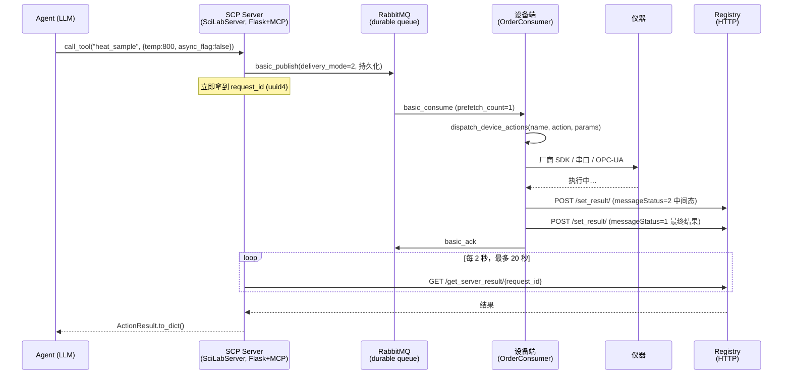

# SCP 湿实验设备控制笔记：MQTT 有什么可以参考的

> 本文基于对 SCP（Science Context Protocol，上海人工智能实验室 InternScience，[arXiv 2512.24189](https://arxiv.org/abs/2512.24189)）参考实现的实际 clone 与逐行阅读，重点是 `src/scp/lab/`（2157 行，SCP 相对 MCP SDK 的核心增量）。
>
> 所有结论均标注 `file:line`。凡属推测的地方会明确写「推测」。
>
> 记录日期：2026-08
>
> 📎 姊妹文档：
> - [Biomni 架构笔记与领域迁移评估](./biomni-architecture-notes.zh.md)
> - [科学 Agent 生态三者对比：Biomni / ToolUniverse / SCP](./scientific-agent-ecosystem-comparison.zh.md)
> - [OPTIMADE 笔记：材料数据的跨库统一查询标准](./optimade-materials-data-notes.zh.md)

## 目录

- [先说结论](#先说结论)
- [第一部分：SCP 到底怎么连设备的](#第一部分scp-到底怎么连设备的)
- [第二部分：真正值得参考的五个设计](#第二部分真正值得参考的五个设计)
- [第三部分：别照抄的地方（12 个具体问题）](#第三部分别照抄的地方12-个具体问题)
- [第四部分：如果自己做，怎么设计](#第四部分如果自己做怎么设计)
- [第五部分：为什么这仍然是唯一值得看的开源参考](#第五部分为什么这仍然是唯一值得看的开源参考)
- [附录：关键代码位置速查](#附录关键代码位置速查)

---

## 先说结论

三句话：

1. **SCP 里的 MQTT 实现是死代码。** `src/scp/lab/cloud/mqtt.py`（600 行，`MQTTCloud` 类）**没有任何模块 import 它**。实际接通设备的传输层是 **RabbitMQ**（`pika`）。所以「参考 SCP 的 MQTT」这个问法本身需要修正。

2. **但值得参考的东西不在传输层。** 真正有价值的是四五个**传输无关**的架构决策——中间态回报、装饰器注册、同步/异步双模、实验上下文注入。这些换成 MQTT、RabbitMQ、甚至 gRPC 都成立。

3. **那 600 行死代码本身有参考价值，作为反面教材。** 它踩的坑（QoS 0、扁平 topic、无 TLS、`clean_session=True`）恰好是「用 MQTT 控制实验设备」最典型的错误，而活着的 RabbitMQ 版本把这些全都修对了。**这个演进方向是整份代码里信息量最大的部分。**

---

## 第一部分：SCP 到底怎么连设备的

### 两套并存的实现

`src/scp/lab/cloud/` 下同时存在两套设备通信实现：

| | MQTT 版 | RabbitMQ 版 |
| --- | --- | --- |
| 文件 | `cloud/mqtt.py`（600 行） | `cloud/cloud_devices.py`（179 行）+ `cloud/cloud_consumer.py`（209 行） |
| 类 | `MQTTCloud` | `DeviceControlSender` + `OrderConsumer` |
| 库 | `paho.mqtt` | `pika` |
| 结果回传 | Redis pubsub + HTTP | HTTP POST 到 registry |
| **被引用** | **零次** | `base.py:222` |

注意 `cloud_devices.py` 这个文件名很有误导性——名字里有 cloud、函数叫 `get_device_cloud_instance()`，但里面**没有一行 MQTT**，全是 `pika`。

### 证据：哪条路是活的

全仓库搜索 MQTT 实现的引用，只有一条命中，而且是注释：

```python
# src/scp/lab/lab_operator/base.py:19
# from scp.lab.cloud.mqtt_device_twin import get_device_cloud_instance
```

这行还指向一个**根本不存在的模块**（`mqtt_device_twin`）。而实际生效的是：

```python
# src/scp/lab/lab_operator/base.py:222
mq_device = cloud_devices.get_device_cloud_instance()
```

→ `cloud_devices.DeviceControlSender`（`pika`）。

另一个佐证：`cloud_consumer.py` 顶部 `import paho.mqtt`，但整个文件只用 `pika`——是从 MQTT 版本改过来时留下的 import 残留。

### 实际接通的调用链



关键点：**指令走消息队列（可靠、持久化），结果回传走 HTTP registry（`base_operator.py:62` 的 `publish_message`），agent 侧靠 HTTP 轮询拿结果（`cloud_devices.py:125` 的 `wait_for_status_update`）。**

这个「指令走 MQ、结果走 HTTP」的混合设计是可以理解的——设备端往往在实验室内网，出网容易、被连难；但轮询那部分是个明显的退化，后面会讲。

### 推测：为什么从 MQTT 换成了 RabbitMQ

> ⚠️ 以下是推测。仓库只有单次提交（shallow clone），拿不到演进历史。

把两版的可靠性设置并排看，方向非常清楚：

| 可靠性维度 | MQTT 版（`mqtt.py`） | RabbitMQ 版（`cloud_devices.py` / `cloud_consumer.py`） |
| --- | --- | --- |
| 投递保证 | **QoS 0**（未指定 qos 参数，默认 0，即 fire-and-forget） | `delivery_mode=2` 消息持久化 |
| 队列持久化 | 无概念 | `durable=True` |
| 消费确认 | 无 | `basic_ack` / `basic_nack(requeue=True)` |
| 掉线期间的消息 | **全丢**（`clean_session=True`，`mqtt.py:363`） | 留在队列里（TTL 1 小时） |
| 背压 | 无 | `basic_qos(prefetch_count=1)` |
| 队列上限 | 无 | `x-max-length: 10000` |
| 失败重投 | 无 | `basic_nack(requeue=True)`（`cloud_consumer.py:206`） |

**对「下发实验指令」这个场景，右边那一列每一项都是必需的，左边那一列每一项都是致命的。** 一条 QoS 0 的「升温到 800 度」指令可以静默消失，没有任何人知道；一条 QoS 0 的「停止加热」指令同理。

所以最值得带走的一条结论是：**问题不在于选 MQTT 还是 RabbitMQ，而在于你有没有把持久化和确认这两件事配对。** MQTT 完全能做到（QoS 1/2 + `clean_session=False` + 遗嘱消息），SCP 的 MQTT 版只是没做。

---

## 第二部分：真正值得参考的五个设计

这五个都是**传输无关**的，也是我认为这份代码里真正的贡献。

### 1. `messageStatus` 中间态：把长任务拆成流式回报

这是最值得直接抄的一个设计。

```python
# src/scp/lab/lab_operator/types.py:12
def __init__(self, message: str, requestId: str = "", index: int = 0,
             result: Any = None, method: str = "", messageStatus: int = 0):
    self.message = message          # 人类可读的消息
    self.requestId = requestId      # 操作实例
    self.index = index              # 步骤序列号 0,1,2,3...
    self.result = result            # 操作结果
    self.method = method            # 操作方法名称
    self.messageStatus = messageStatus  # 1 最终结果 / 2 中间结果 / -1 错误
```

配合一个六态枚举：

```python
# src/scp/lab/lab_operator/types.py:91
class DeviceStatus(Enum):
    PENDING = "pending"      # 等待执行
    RUNNING = "running"      # 正在执行
    SUCCESS = "success"      # 执行成功
    ERROR = "error"          # 执行错误
    TIMEOUT = "timeout"      # 执行超时
    CANCELLED = "cancelled"  # 已取消
```

**为什么这是必需的**：MCP 的 tool 返回值是**一次性**的——调用、返回、结束。这个模型装不下「一次合成跑六小时、中间要报进度、可能失败、可能需要人工干预」。`messageStatus=2` 的中间态加上 `index` 步骤序号，让同一个 `requestId` 可以推送任意多条进展消息，最后用 `messageStatus=1` 收尾。

**这就是 SCP 论文说「MCP 装不下科学场景」的最具体证据**，也是为什么它要 fork MCP SDK 而不是写个 MCP server 了事。

对你的场景直接可用：管式炉升温可以每 30 秒报一次「当前 420°C，目标 800°C，预计还需 25 分钟」，agent 能据此决定是等还是先去干别的。

### 2. 装饰器把设备动作注册成 agent 工具

设备工程师只写设备动作，agent 工具自动生成：

```python
# src/scp/lab/lab_operator/base.py:46
def scp_register(scp_action: str):
    """Decorator to register a method as a device action and SCP tool."""
    def decorator(func: Callable) -> Callable:
        ...
        # 从 params 的 TypedDict 注解里抽出每个字段
        for field_name, field_type in param_class.__annotations__.items():
            param_info[field_name] = {
                'type': field_type,
                'required': True,
                'description': f"Parameter: {field_name}"
            }
```

然后在 `register_scp_tools()` 里用 `inspect.Signature` 动态合成一个 MCP 工具函数：

```python
# src/scp/lab/lab_operator/base.py:258
new_sig = Signature(parameters=parameters, return_annotation=Dict[str, Any])
...
# base.py:299
tool_func.__name__ = current_action_name
tool_func.__doc__ = current_metadata['doc']
tool_func.__signature__ = new_sig
scp.tool()(tool_func)
```

**值得参考的点**：schema 来源是**类型注解**（`TypedDict` 的 `__annotations__`），不是 LLM 推断。对比 Biomni 的 `add_tool()`——那个是把源码丢给 LLM 生成 schema（`biomni/utils.py:251` 的 `function_to_api_schema`）。

| | SCP | Biomni |
| --- | --- | --- |
| schema 来源 | 类型注解，确定性 | LLM 从源码推断 |
| 成本 | 零 | 一次 LLM 调用 |
| 描述质量 | 差（`f"Parameter: {field_name}"` 占位符） | 好（LLM 会写人话） |

**对设备控制，确定性比描述质量重要得多**——参数错了会烧样品。合理的做法是取两者之长：类型和必填性从注解拿，描述从 docstring 拿（SCP 只做了前一半，`description` 是个没用的占位符）。

### 3. `async_flag`：同一个工具既能同步也能异步

```python
# src/scp/lab/lab_operator/base.py:285
if request_id:
    if not params.get('async_flag', False):
        # 同步：阻塞等结果
        result = mq_device.wait_for_status_update(request_id)
        if result:
            return ActionResult(message="success", messageStatus=1, ...).to_dict()
        else:
            return ActionResult(requestId=request_id, messageStatus=2,
                                message="同步结果获取失败，通过异步方式获取").to_dict()
    else:
        # 异步：立刻返回 request_id
        return ActionResult(requestId=request_id, messageStatus=2,
                            message="异步操作已提交，请通过状态更新获取结果").to_dict()
```

**这是给 agent 的关键可供性**：短动作（读一下温度）用同步，写起来简单；长动作（升温两小时）用异步，立刻拿 `request_id` 走人，不占着 agent 的上下文和超时预算。

而且注意**超时降级的处理很漂亮**：同步等超时了不报错，而是返回 `messageStatus=2` 加 `request_id`，等价于告诉 agent「太慢了，转异步吧，凭这个号来查」。这个设计避免了「同步超时 = 任务失败」的错误语义——**指令已经发出去了，设备还在跑，只是你不该继续等**。

湿实验里这个区分极其重要：**超时不等于失败**。把它俩混为一谈，agent 会去重试一个正在执行的操作。

### 4. 实验上下文作为每次调用的必填参数

```python
# src/scp/lab/lab_operator/types.py:139
class BaseParams(TypedDict, total=False):
    user_id: str            # 用户ID【鉴权】
    organization_id: str    # 机构ID【鉴权】
    creat_time: date
    experiment_type: Literal["dry-experiment", "wet-experiment", "dry-wet-experiment"]
    experiment_name: str
    experiment_des: str
    priority: Literal["high", "med", "low"]
    request_id: str
    async_flag: bool

# types.py:167
class DeviceParams(BaseParams, total=False):
    device_name: str        # 实验室名称+内部分类+具体功能
    device_id: str          # 设备编码
    device_des: str
    customized_params: List[Any]
```

**溯源和权限不是外挂的中间件，是每个动作签名里的必填字段。** 每一次设备调用都自带「谁、哪个机构、属于哪个实验、什么优先级」。

这对湿实验的意义远大于对软件的意义：出了事故要能追到人；多个课题组共用一台仪器要能排队和计费；实验记录要能进 ELN 和论文补充材料。**把这些做成参数而不是装饰器/中间件，代价是签名变丑，好处是不可能漏。**

注意 `device_name` 那句注释：「实验室名称+内部分类+具体功能」——这是个约定式的命名空间，比裸 ID 可读，agent 也更容易理解自己在操作什么。

### 5. 三类资源分开注册

`base.py` 里维护了四套注册表：

```python
# src/scp/lab/lab_operator/base.py:25
_ACTION_REGISTRY   # 设备动作（@device_action）
_AGENT_REGISTRY    # 实验室 agent（@agent_action）
_DATA_REGISTRY     # 数据操作（@data_action）
_SCP_REGISTRY      # 对外暴露为 SCP 工具的（@scp_register）
```

**「内部动作」和「对外工具」是两套。** 一个设备可以有 50 个内部动作，只挑 8 个 `@scp_register` 暴露给 agent。

这个区分对安全很关键——`calibrate_zero_point()`、`override_interlock()` 这类动作你根本不希望出现在 agent 的工具列表里。**最小暴露面**在设备控制场景不是洁癖，是安全边界。

---

## 第三部分：别照抄的地方（12 个具体问题）

我读代码时记录的问题，按严重程度排。列出来不是为了挑刺——**这些坑你自己写的时候大概率也会踩，提前知道值钱。**

### 严重（会导致丢指令或安全事故）

**1. QoS 0 —— 指令可能静默丢失**

```python
# src/scp/lab/cloud/mqtt.py:467
result = self.mqtt_client.publish(self.device_control_topic, json.dumps(payload))
# src/scp/lab/cloud/mqtt.py:248
result, mid = client.subscribe(self.device_status_topic)
```

publish 和 subscribe 都没传 `qos`，paho 默认 QoS 0。`result.rc == 0` 只说明**消息交给了本地网络栈**，不代表 broker 收到，更不代表设备收到。控制指令必须 QoS 1 起步。

**2. `clean_session=True` —— 掉线期间消息全丢**

```python
# src/scp/lab/cloud/mqtt.py:363
self.mqtt_client = mqtt.Client(mqtt.CallbackAPIVersion.VERSION1, self.client_id, clean_session=True)
```

设备网络抖一下，这段时间的所有指令和状态永久消失。注释说这么设是为了「avoid session conflicts」——那是在用错误的方式解决 client_id 冲突。

**3. 没有遗嘱消息（LWT）**

全文没有 `will_set()`。这意味着**设备掉线时没人知道**。MQTT 最适合设备控制的特性就是 LWT——设备异常断连时 broker 自动代发一条「我掉了」。控制着加热设备而不知道它是否在线，是很危险的状态。

**4. 没有 TLS**

```python
# src/scp/lab/cloud/mqtt.py:380
self.mqtt_client.connect(self.endpoint, int(self.port), 60)
```

没有 `tls_set()`，没有引用 8883 端口。而认证用的是阿里云 MQTT 的签名式（`mqtt.py:372`，`Signature|AK|instanceId` + HMAC-SHA1），**AK 和签名走明文传输**。设备指令同样明文。

**5. 全局扁平 topic —— 所有设备收到所有指令**

```python
# src/scp/lab/cloud/mqtt.py:100
self.device_control_topic = ... or os.getenv("MQTT_DEVICE_CONTROL_TOPIC", "device_control")
self.device_status_topic  = ... or os.getenv("MQTT_DEVICE_STATUS_TOPIC",  "device_status")
```

整个系统只有两个 topic，所有设备订阅同一个 `device_control`，靠 `dispatch_device_actions` 里比对 `device_name` 自己过滤（`base.py:159`）。

两个后果：**扩展性**——每台设备都要处理全部流量；**安全**——任何一台设备（或任何拿到凭证的人）能看到所有实验室所有指令。MQTT 的层级 topic（`lab/{lab_id}/device/{device_id}/cmd`）加 ACL 正是为解决这个而存在的，没用上很可惜。

### 中等（功能不正确）

**6. 异步回调路径根本走不到，走到也会崩**

键写入时带前缀：

```python
# src/scp/lab/cloud/mqtt.py:525
redis_channel = f"{REDIS_STATUS_CHANNEL_PREFIX}{request_id}"   # "device_status:{id}"
self.callbacks[redis_channel] = callback
```

查询时用裸 `request_id`：

```python
# src/scp/lab/cloud/mqtt.py:313
if request_id in self.callbacks:
```

**键不匹配，这个分支永远不成立。** 而假如它成立且回调是协程，下一行会 `NameError`——`redis_channel` 在 `on_message` 作用域里从未定义：

```python
# src/scp/lab/cloud/mqtt.py:317
self.async_callback_queue.append((callback, payload, redis_channel))
```

**7. `wait_for_status_update` 是 HTTP 轮询，不是消息驱动**

```python
# src/scp/lab/cloud/mqtt.py:492  和  cloud_devices.py:138（两份重复代码）
while elapsed_time < timeout:
    result = get_message(self.registry_url, request_id)
    if result:
        return result
    time.sleep(2)
```

搭了一整套消息队列，结果等结果时用 HTTP 每 2 秒轮询一次。**这把消息中间件最大的好处（推送）绕开了**，还带来 0–2 秒的固有延迟。

**8. 默认超时 20 秒 —— 对湿实验毫无意义**

同上两处，`timeout: float = 20.0`。任何真实的湿实验动作都不止 20 秒。虽然有前面说的「超时转异步」降级兜着，但结果是**同步模式实际上永远走不通**，所有调用都退化成异步。

**9. `get_device_cloud_instance()` 无参调用会返回 `None`**

```python
# src/scp/lab/cloud/cloud_devices.py:170
if _device_cloud_instance is None:
    if admin is None:
        return None          # ← 无参调用走这里
```

而调用方没传任何参数：

```python
# src/scp/lab/lab_operator/base.py:222
mq_device = cloud_devices.get_device_cloud_instance()
```

除非别处先用完整参数初始化过全局单例，否则 `mq_device` 是 `None`，后面 `mq_device.send_device_control(...)` 直接 `AttributeError`。**依赖隐式的初始化顺序**，没有任何检查或报错。

### 轻微（代码卫生）

**10. `keepalive` 设了又被覆盖**：`mqtt.py:377` 设 `self.mqtt_client.keepalive = 120`，`mqtt.py:380` 的 `connect(..., 60)` 第三个参数又是 keepalive，实际生效 60。

**11. 调试残留**：`mqtt.py:446` 留着 `# request_id = str(111)`；`cloud_consumer.py` 顶部 `import paho` 但全文只用 `pika`；`types.py:48-84` 是大段注释掉的 `SuccessResult` / `ErrorResult`。

**12. `lab` 模块零文档零示例**：全仓库搜 `scp_register` / `device_action` / `OrderConsumer`，在 `src/scp/lab/` 之外**零命中**——没有 README、没有 example、没有 notebook。207 个 skills 里也没有一个演示设备控制。

---

## 第四部分：如果自己做，怎么设计

结合你的场景（材料实验设备），我会这样分层。

### 传输选型

| 方案 | 适合 | 不适合 |
| --- | --- | --- |
| **MQTT**（QoS 1 + `clean_session=False` + LWT + TLS + 层级 topic + ACL） | 设备多、在内网、需要在线状态感知、带宽受限 | 需要复杂路由或事务 |
| **RabbitMQ**（durable + `delivery_mode=2` + ack/nack + prefetch） | 指令必须不丢、需要重试和死信队列、需要优先级 | 设备端资源受限、要感知在线状态 |
| **纯 HTTP + 轮询** | 设备极少（1–3 台）、都在同一台机器上 | 任何要扩展的场景 |

**对材料实验室我倾向 MQTT，但理由和 SCP 论文说的不一样。** 不是因为「发布订阅比请求响应好」，而是因为两个具体特性：

1. **LWT（遗嘱消息）**——你必须知道管式炉的控制器是不是还活着。这是 RabbitMQ 不直接提供的。
2. **层级 topic + ACL**——`lab/{lab}/furnace/{id}/cmd` 配合 broker 端 ACL，能做到「XRD 的控制器无论如何都订阅不到炉子的指令」。这是**在 broker 层强制的隔离**，比在应用层比对 `device_name` 可靠得多（SCP 恰好做成了后者）。

如果指令的可靠投递和重试是首要矛盾，RabbitMQ 更省心。**两者都用也很常见**：MQTT 接设备边缘，RabbitMQ 做后端任务队列。

### 分层

```
Agent (LLM)
    ↓  MCP tool call
MCP Server（工具定义、参数校验、权限、审计）
    ↓  消息队列（持久化 + 确认）
设备适配器 Adapter（一台设备一个进程）
    ↓  厂商 SDK / 串口 / OPC-UA / SCPI
仪器
```

关键是**适配器这一层必须独立成进程**。它要处理厂商 SDK 的各种脾气（阻塞调用、非线程安全、崩溃），不能和 MCP server 同生共死。SCP 的 `OrderConsumer` 就是这一层，这个划分是对的。

### 湿实验特有的、软件世界不需要考虑的东西

这些是我认为比传输选型重要得多的部分：

**1. 幂等和去重。** 消息队列的重投（`basic_nack(requeue=True)`）在软件里是好事，在设备上可能意味着**样品被加热两次**。每条指令要带幂等键，适配器要维护「已执行的 request_id」并拒绝重复。SCP 有 `request_id`，但**没有任何去重逻辑**——`on_message` 收到重复消息会老老实实再执行一遍。

**2. 超时分级，而且超时 ≠ 失败。** SCP 的「超时转异步」思路是对的，要做得更彻底：
- *通信超时*（秒级）：指令没送达 → 可以安全重试
- *执行超时*（小时级）：设备在跑但超预期 → **绝不能重试**，要去查状态
- 两者混淆是设备控制最容易出的事故

**3. 急停通道。** 必须有一条不排队、不走正常队列的紧急停止路径。正常指令队列可能积压 10000 条（SCP 的 `x-max-length`），急停不能排在后面。MQTT 里通常是独立 topic + QoS 1 + 更高优先级连接。

**4. 物理不可逆动作要人确认。** 这条和 [Biomni 笔记里 oracle 那一节](./biomni-architecture-notes.zh.md#前提三最关键代码有免费的正确性裁判科学没有) 直接相连：

> 代码写错了，`git revert`；炉子升错温度，样品没了，最坏起火。

湿实验不但**没有 oracle**（没有测试告诉你参数选对了），而且**错误不可撤销**。所以架构上必须有一类动作标记为「需人工确认」，由 MCP server 在下发前阻塞等待人的批准。SCP 的 `BaseParams` 里有 `priority` 但**没有这个概念**，这是我认为它最大的缺失。

**5. 干运行（dry-run）模式。** 每个设备动作都应支持 `dry_run=true`，返回「我将要做什么」而不真做。这是 agent 时代的必需品——让模型能先验证自己理解对了。这也是**部分弥补 oracle 缺失**的实用手段。

**6. 审计日志和 ELN 对接。** SCP 的 `BaseParams` 注入实验上下文是对的方向，但它只是把字段传下去，没有落库。要能回答「三个月前那批样品是谁用什么参数烧的」。

### 材料实验设备的共性

你提到的方向，常见设备的时间尺度和风险：

| 设备 | 时间尺度 | 风险特征 |
| --- | --- | --- |
| 管式炉 / 马弗炉升温程序 | 数小时 | 高温，不可逆，有火灾风险 |
| XRD 测量 | 十几分钟到几小时 | 低，可重测 |
| 手套箱 / 真空系统 | 分钟到小时 | 有互锁，误操作破坏气氛 |
| 电化学工作站（充放电循环） | 数天 | 中断即整个实验作废 |
| 球磨 / 混料 | 小时 | 低 |
| SEM / TEM | 小时 | 设备贵，误操作代价高 |

共性是**慢、不可撤销、有安全联锁**。这三条正好是 HTTP 请求-响应模型的三个盲区，也解释了 SCP 为什么非要在 MCP 上加东西。

---

## 第五部分：为什么这仍然是唯一值得看的开源参考

尽管上面列了 12 个问题，SCP 的 `lab/` 仍然是这个方向唯一的开源参考。我实测过另两个项目：

| | 设备控制代码 |
| --- | --- |
| **Biomni**（Stanford） | 无。`lab_automation.py` 只有 3 个工具，是协议文本生成，不控制硬件 |
| **ToolUniverse**（Harvard） | 无。2899 个工具里**机器人/实验室自动化类为 0**，论文提到 robotics 但代码里没有 |
| **SCP**（上海 AI Lab） | **有**，2157 行，真实的消息队列 + 设备注册 + 中间态回报 |

所以结论是：**看它的设计，不要抄它的代码。**

值得带走的：`messageStatus` 中间态模型、`DeviceStatus` 六态枚举、装饰器注册加类型注解生成 schema、`async_flag` 双模、超时降级为异步、实验上下文作为必填参数、内部动作与对外工具分离。

不要带走的：那 600 行 MQTT（QoS 0、无 TLS、扁平 topic、回调键不匹配）、HTTP 轮询等结果、20 秒默认超时、隐式单例初始化。

还有一个元层面的观察：**SCP 是三者中唯一真多学科的**——[对比笔记](./scientific-agent-ecosystem-comparison.zh.md)里统计过它非生物占约 54%（物理 21.1% / 化学 11.6% / 力学与材料 8.7%）。如果你要做材料方向，它的**领域分类和工具组织方式**比它的传输层代码更值得参考。

---

## 附录：关键代码位置速查

| 内容 | 位置 |
| --- | --- |
| MQTT 实现（**死代码**） | `src/scp/lab/cloud/mqtt.py`（600 行，`MQTTCloud`） |
| RabbitMQ 发送端（**实际生效**） | `src/scp/lab/cloud/cloud_devices.py:20`（`DeviceControlSender`） |
| RabbitMQ 消费端（设备侧） | `src/scp/lab/cloud/cloud_consumer.py:117`（`OrderConsumer`） |
| 结果回传 / 查询（HTTP） | `src/scp/lab/cloud/base_operator.py:40`（`get_message`）、`:62`（`publish_message`） |
| `ActionResult` 与 `messageStatus` | `src/scp/lab/lab_operator/types.py:12` |
| `DeviceStatus` 六态枚举 | `src/scp/lab/lab_operator/types.py:91` |
| `BaseParams` / `DeviceParams` / `AgentParams` | `src/scp/lab/lab_operator/types.py:139` / `:167` / `:195` |
| `@scp_register` 装饰器 | `src/scp/lab/lab_operator/base.py:46` |
| `@device_action` 装饰器 | `src/scp/lab/lab_operator/device.py:19` |
| 四套注册表 | `src/scp/lab/lab_operator/base.py:25-42` |
| 动作分派 | `src/scp/lab/lab_operator/base.py:146`（`dispatch_device_actions`） |
| 动态生成 MCP 工具 | `src/scp/lab/lab_operator/base.py:209`（`register_scp_tools`）、`:265`（`create_tool_wrapper`） |
| 同步/异步分支 | `src/scp/lab/lab_operator/base.py:285` |
| SCP Server（Flask + MCP） | `src/scp/lab/server.py:8`（`SciLabServer`） |
| 客户端 | `src/scp/lab/client.py:16`（`SciLabClient`） |

### 未核实的部分

- **为什么从 MQTT 换到 RabbitMQ** 是推测。仓库只有一次提交，拿不到演进历史。
- **托管的 SCP Hub 里是否有更完善的设备控制实现**未知。开源部分是 SDK，2200+ 工具在远端且需 `SCP-HUB-API-KEY`。论文描述的智能编排能力在开源代码里找不到对应实现。
- **本文所有代码都没有实际运行**。缺 MQTT broker、RabbitMQ、Redis、registry 服务和真实设备，无法端到端验证。上面的问题清单来自静态阅读，其中「回调键不匹配」和「`get_device_cloud_instance()` 返回 None」这两条是逻辑推断，未经运行时确认。
- 第四部分的架构建议是设计判断，**没有实现和验证**。
